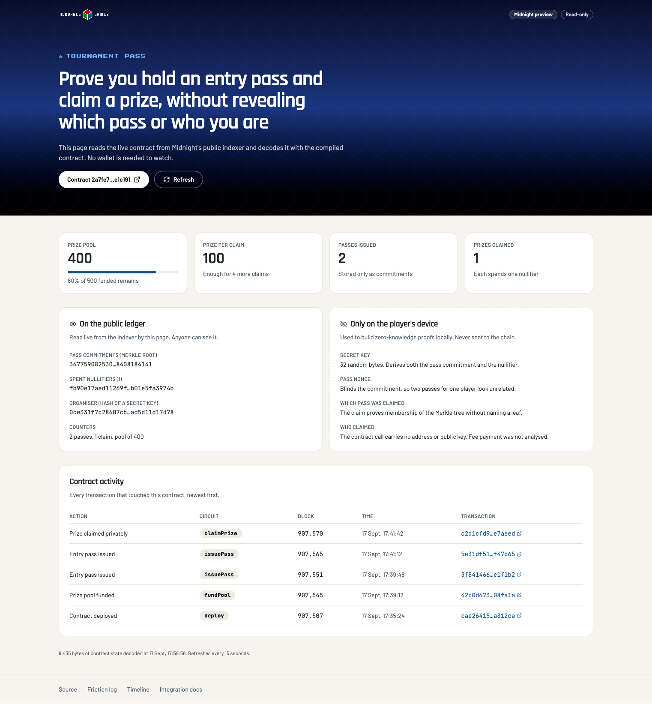

# moddable-midnight

**[View the live contract page](https://moddable-games.github.io/moddable-midnight/)**

A proof of concept on [Midnight](https://midnight.network), the data-protection
blockchain, exploring what selective disclosure offers a games platform, and a
timed, documented record of what it takes a newcomer to ship on it.

Moddable runs a rules-driven game engine, a public API and a tools layer. Some
game mechanics need a player to prove something without revealing everything:
that they are entitled to enter, that a result is genuine, that a prize is owed.
That is the shape Midnight is built for, so this repository tests it directly.

This repository now holds two experiments, both in the spirit of building on
Midnight and writing down every seam:

1. **Building _on_ Midnight** — the tournament-pass Compact contract below,
   deployed to the `preview` network with a private claim made on-chain.
2. **Operating _inside_ Midnight City** — running a coordinated three-agent crew
   in IO Global's agentic simulation, with a live status page and a full set of
   findings. See **[notes/midnight-city](notes/midnight-city/README.md)** and the
   **[live fleet status](https://moddable-games.github.io/moddable-midnight/city.html)**.

## At a glance

| | |
|---|---|
| **Contract** | [`tournament_pass.compact`](contracts/tournament_pass.compact): private entry passes plus a prize pool, claimed by proof |
| **Tests** | 14 assertions, including an adversarial stolen-path case ([`src/`](src/README.md)) |
| **Crew treasury (v2)** | [`crew_treasury.compact`](contracts/crew_treasury.compact): Midnight City Credits (MCC), one shielded Agent Smart Contract NFT per agent, private capped draws. [Audited](notes/AUDIT-crew-treasury.md) before deploy; live at [`e412fa7f…cac4b4`](https://preview.midnightexplorer.com/contracts/e412fa7fa89433c2d37bbf350eba95e61db6075d5189f0dc5f45c07583cac4b4) |
| **Wallet** | A Firefox-friendly browser wallet over a local daemon holding the organiser's and three agents' wallets, with approvals and per-agent limits ([notes](notes/WALLET-DAEMON.md)) |
| **Deployed** | [`2a7fe78c…e1c191`](https://preview.midnightexplorer.com/contracts/2a7fe78cdafc8126041298f307f699b319ed43e908e85287f8b72ad291e1c191) on the `preview` testnet, with a private claim made on-chain |
| **Front end** | [Live read-only page](https://moddable-games.github.io/moddable-midnight/) decoding contract state from the public indexer ([`web/`](web/)) |
| **Toolchain** | Compact compiler 0.31.1, runtime 0.16.0, Midnight.js 4.1.1, proof server 8.1.0 ([versions](docs/INTEGRATION.md#versions-that-work-together)) |
| **Clock** | +77 minutes to deploy, +84 to a private claim on-chain, by an agent wallet ([timeline](notes/TIMELINE.md)) |
| **Findings** | 43 logged for the contracts and wallet, plus a Midnight City set ([friction log](notes/FRICTION-LOG.md), [city findings](notes/midnight-city/FINDINGS.md)) |
| **Midnight City** | A three-agent fleet run inside IO Global's agentic sim ([notes](notes/midnight-city/README.md), [live page](https://moddable-games.github.io/moddable-midnight/city.html)) |



## The notes

The code is the smaller half of this repository. The notes are the point.

| Document | What it holds |
|---|---|
| [**Friction log**](notes/FRICTION-LOG.md) | Every obstacle, surprise and pleasant surprise met on the way, each with evidence and a suggested fix |
| [**Timeline**](notes/TIMELINE.md) | Milestones from repository creation to a contract in a public explorer, timed from git history and command output |
| [**Kapa queries**](notes/KAPA-QUERIES.md) | Every question put to Midnight's knowledge base server, what came back, and what it changed |
| [**Security audit**](notes/AUDIT-crew-treasury.md) | The crew treasury audited with Midnight's own review and verification tooling: what it caught, what it missed, and what only the chain could answer |
| [**Wallet daemon**](notes/WALLET-DAEMON.md) | The browser wallet, the agents' route and limits, token metadata, and every on-chain result, checked against the public indexer |
| [**Integration**](docs/INTEGRATION.md) | Addresses, endpoints, public versus private data, real indexer responses, CLI commands and pinned SDK versions |

### Worth reading first

- [A security gap in the documented Merkle membership pattern](notes/FRICTION-LOG.md#9-skill-guidance-for-merkle-membership-has-a-security-gap),
  and the one-line fix this contract uses
- [Exported circuit parameters are witness-tainted](notes/FRICTION-LOG.md#8-exported-circuit-parameters-are-witness-tainted-and-no-skill-says-so),
  which no guidance mentions
- [The knowledge base server needs an undocumented sign-in](notes/FRICTION-LOG.md#1-the-kapa-mcp-server-needs-a-sign-in-the-docs-do-not-mention),
  and [how much better it is once connected](notes/FRICTION-LOG.md#15-kapa-is-much-better-than-grepping-the-docs-index-positive)
- [Deploying a contract with witnesses relies on an unwritten convention](notes/FRICTION-LOG.md#18-the-wallet-cli-deploys-witness-contracts-only-if-you-match-an-unwritten-convention)
- [The newest compiler cannot be deployed with the stable SDK](notes/FRICTION-LOG.md#20-the-newest-compiler-cannot-be-deployed-with-the-stable-sdk)
- [The wallet CLI replaces a contract's private state on every call](notes/FRICTION-LOG.md#26-the-wallet-cli-replaces-a-contracts-private-state-on-every-call)
- [The front-end scaffold does not typecheck, test or build untouched](notes/FRICTION-LOG.md#32-the-untouched-scaffold-does-not-typecheck-test-or-build)

### Open questions

Ideas beyond the proof of concept, researched against the docs and source:

- [Passwordless onboarding with passkeys and WebAuthn](notes/FRICTION-LOG.md#passwordless-onboarding-passkeys-and-webauthn)
- [Machine-payable endpoints and faucets agents can use](notes/FRICTION-LOG.md#machine-payable-endpoints-and-faucets-for-agents)
- [An agent-shaped wallet, and where its limits are enforced](notes/FRICTION-LOG.md#an-agent-shaped-wallet)

## The proof of concept

A tournament pass and a prize pool:

- **Entry pass (non-fungible):** issued per tournament, held privately
- **Prize pool (fungible):** funded once, paid against a proven pass
- **The claim:** a player proves they hold a valid pass for a given tournament
  and claims a prize, without disclosing which pass or who they are

### How the claim stays private

1. A player commits to a pass off-chain: a hash of their secret key and a fresh
   nonce, with domain separation. Only the commitment goes on-chain, into a
   historic Merkle tree.
2. To claim, the player proves in zero knowledge that their commitment is in the
   tree. The circuit rebinds the supplied path to the commitment it derives, so
   a path copied from someone else's pass cannot be replayed.
3. The claim publishes a nullifier derived from the tournament, secret key and
   nonce. Spending it twice fails, and it reveals nothing about which pass it
   came from.

**In scope:** issuing passes, funding a pool, one private claim path, tests.

**Out of scope:** transfers, secondary markets, multi-round tournaments, a front
end. This is an experiment, not a product.

**Limits:** the prize pool counts entitlement rather than moving tokens, one
wallet played every role, and two passes make a very small anonymity set. The
[limits and caveats](docs/INTEGRATION.md#limits-and-caveats) section covers
these and what an observer can actually see on-chain, each point with its
source.

## Quick start

```bash
npm install
npm run compile     # Compact to circuits, keys and TypeScript bindings
npm run typecheck
npm test            # in-memory simulator, no network needed
npm run web         # read-only front end on http://localhost:5173
```

Deploying and calling the contract from a terminal is covered in
[the integration guide](docs/INTEGRATION.md#writing-wallet-proof-server-and-sdk).

Requires macOS or Linux (Windows via WSL), Node.js 20 or newer, and the
[Compact toolchain](https://docs.midnight.network). The Midnight Expert plugin
suite from [midnightntwrk.expert](https://midnightntwrk.expert) was used
throughout the build.

## Layout

| Path | Contents |
|---|---|
| [`contracts/`](contracts/README.md) | Compact source |
| [`src/`](src/README.md) | Witnesses, simulator harness and tests |
| [`scripts/`](scripts/) | Helpers for on-chain use: a pass commitment, and building token metadata |
| [`wallet-daemon/`](wallet-daemon/) | Local wallet process: the four wallets, approvals, contract calls, agents' route |
| [`wallet-ui/`](wallet-ui/) | The browser wallet page |
| [`metadata/`](metadata/) | Token artwork and metadata documents, addressed by IPFS CID |
| [`spikes/`](spikes/) | Throwaway proofs, such as the minting spike and the drain regression |
| [`web/`](web/) | React front end (Vite, shadcn, Tailwind), scaffolded with `midnight-dapp-dev` |
| [`api/`](api/) | Provider wiring for browser writes, from the same scaffold |
| [`docs/`](docs/INTEGRATION.md) | Integration guide |
| [`notes/`](notes/) | Friction log, timeline, knowledge base queries, audit and wallet notes |

## References

The contract uses only the Compact standard library. These libraries were
reviewed as reference points and are the route to real token behaviour:

- [OpenZeppelin Compact contracts](https://github.com/OpenZeppelin/compact-contracts)
  (MIT): token, access, security, multisig, crypto and utils modules
- [Midnight example NFT contracts](https://github.com/midnightntwrk/example-nft-contracts)

## Changelog

#### 2026-09-23
- A browser wallet for Firefox, backed by a local wallet daemon that holds the organiser's and three agents' wallets, saves sync progress, and sends nothing without approval
- Crew treasury contract (v2): organiser-only minting of Midnight City Credits (MCC), a one-of-one shielded Agent Smart Contract NFT per agent, and private draws limited to one per mandate per organiser-opened period
- Audited before deploy with Midnight's security review and verification tooling; the critical finding (a caller-chosen period let one mandate drain the treasury) was confirmed by attack and fixed, with the report in `notes/AUDIT-crew-treasury.md`
- Deployed on preview by the organiser: 1,000,000 MCC minted, NFTs visible in each agent's own wallet, draws paid and repeat draws refused
- Token metadata per Midnight's spec, images and documents addressed by IPFS CID, digests anchored in the contract and checked before the wallet shows a name or image
- Agents can request spends through their own authenticated route: small crew transfers and treasury draws run at once, larger or external ones wait for the organiser
- Friction findings 38 to 43 and Kapa queries 7 to 12

#### 2026-09-21
- Overburdened agents now sell anything a merchant will buy, not just their own trade good
- Tool buying covers every skill an agent actually practises, not only its profession
- The crew notices game updates: a change in the content version is logged and shown on the status page

#### 2026-09-20
- Contracts are now a goal rather than an accident: the crew works towards the most valuable contract it can reach, and never hands over food it still needs
- Contract goals are abandoned after twelve fruitless rounds: one node's live yield does not match the content, which had the whole crew gathering the wrong item indefinitely
- Contract deliveries now travel to the contract's area first; the loop had been re-issuing a delivery the game refused every round, leaving all three agents idle
- Stopped cooking: cooked fish cannot be eaten although the game lists it as food, which had left all three agents starving for about a day; a refused meal now marks that item inedible for good

#### 2026-09-19
- The Midnight City crew now runs on an always-on Cloudflare Worker (`worker/`): a one-minute Cron Trigger runs three action rounds, replies to every open conversation, works through a queue of late replies, and buys profession tools once an agent qualifies
- Fixed a starvation deadlock in the crew's decision logic: hungry agents could not sell goods to pay for food, and crafting always outranked selling
- Crew replies now come from Workers AI in each agent's voice, with the pre-written templates as fallback
- The crew feeds itself: fishing needs no rod, one gather lands a fish in about 3 seconds, so agents keep three fish and eat before getting hungry instead of buying food
- Agents buy any tool on sale that speeds their profession or fishing (the treasury covers a shortfall), and self-supply tools nobody sells by walking the recipe chain and training the crafting skill it needs; nothing else is crafted, so no surplus builds up
- Open contracts are matched against their real requirements
- Logged that listed merchant prices and food values differ from what the server applies, that conversations close after an hour, that late replies are rate limited, and that crystal transfers have a weekly allowance

#### 2026-09-18
- Added a second experiment: operating a coordinated three-agent fleet inside Midnight City, IO Global's agentic simulation. Live status page (`web/public/city.html`, reads the public observer API) plus a notes set: overview, world model, income strategy and findings

#### 2026-09-17
- Tournament pass contract with Merkle membership, nullifiers and in-circuit organiser checks; 14 tests including an adversarial witness
- Deployed to the `preview` testnet by an agent wallet, then funded, a pass issued and a prize claimed privately on-chain
- Moved to the supported toolchain (compiler 0.31.1, Midnight.js 4.1.1) after 0.34.0 failed at deploy
- Read-only front end decoding live state from the indexer, published on GitHub Pages with links to three explorers
- Integration guide with real indexer responses, pinned versions, and caveats checked against chain data
- Friction log (37 findings), timeline and Kapa query record

## Licence

[MIT](LICENSE)
